

<picture><source media="(prefers-color-scheme: dark)" srcset="assets/hero-dark.svg"><source media="(prefers-color-scheme: light)" srcset="assets/hero-light.svg"></picture>

<table>
<tr>
<td><picture><source media="(prefers-color-scheme: dark)" srcset="assets/m1-dark.svg"><source media="(prefers-color-scheme: light)" srcset="assets/m1-light.svg"></picture></td>
<td><picture><source media="(prefers-color-scheme: dark)" srcset="assets/m2-dark.svg"><source media="(prefers-color-scheme: light)" srcset="assets/m2-light.svg"></picture></td>
<td><picture><source media="(prefers-color-scheme: dark)" srcset="assets/m3-dark.svg"><source media="(prefers-color-scheme: light)" srcset="assets/m3-light.svg"></picture></td>
</tr>
</table>

<picture><source media="(prefers-color-scheme: dark)" srcset="assets/journey-dark.svg"><source media="(prefers-color-scheme: light)" srcset="assets/journey-light.svg"></picture>

<table>
<tr>
<td><a href="https://holdmycoffee.lol/"><picture><source media="(prefers-color-scheme: dark)" srcset="assets/p-algotrade-dark.svg"><source media="(prefers-color-scheme: light)" srcset="assets/p-algotrade-light.svg"></picture></a></td>
<td><a href="https://www.helloskippr.com/"><picture><source media="(prefers-color-scheme: dark)" srcset="assets/p-skippr-dark.svg"><source media="(prefers-color-scheme: light)" srcset="assets/p-skippr-light.svg"></picture></a></td>
</tr>
<tr>
<td><a href="https://play.google.com/store/apps/details?id=com.company.bingebit&hl=en_IN"><picture><source media="(prefers-color-scheme: dark)" srcset="assets/p-snaplay-dark.svg"><source media="(prefers-color-scheme: light)" srcset="assets/p-snaplay-light.svg"></picture></a></td>
<td><a href="https://github.com/bossgghere"><picture><source media="(prefers-color-scheme: dark)" srcset="assets/p-polymarket-dark.svg"><source media="(prefers-color-scheme: light)" srcset="assets/p-polymarket-light.svg"></picture></a></td>
</tr>
</table>

<picture><source media="(prefers-color-scheme: dark)" srcset="assets/stack-dark.svg"><source media="(prefers-color-scheme: light)" srcset="assets/stack-light.svg"></picture>

<a href="https://www.onedaystudio.in/"><picture><source media="(prefers-color-scheme: dark)" srcset="assets/studio-dark.svg"><source media="(prefers-color-scheme: light)" srcset="assets/studio-light.svg"></picture></a>

 

[Portfolio](https://www.gourav.fun/) &nbsp;·&nbsp; [LinkedIn](https://www.linkedin.com/in/gourav-raut) &nbsp;·&nbsp; [Email](mailto:gouravraut1234@gmail.com)

